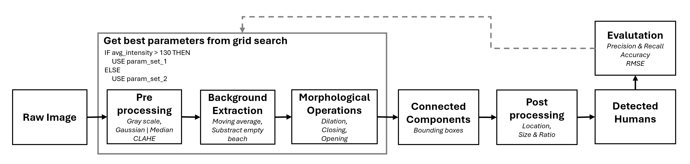
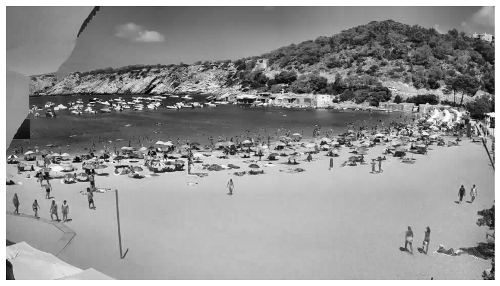

<a id="readme-top"></a>


<!-- PROJECT LOGO -->
<br />
<div align="left">
    
</div>

<h3 align="left">Identifying and counting humans at beaches</h3>


<!-- TABLE OF CONTENTS -->
<details>
  <summary>Table of Contents</summary>
  <ol>
    <li>
      <a href="#about-the-project">About The Project</a>
      <ul>
        <li><a href="#built-with">Built With</a></li>
      </ul>
    </li>
    <li>
      <a href="#getting-started">Getting Started</a>
      <ul>
        <li><a href="#set-up-project">Set up project</a></li>
      </ul>
    </li>
    <li><a href="#usage">Usage</a></li>
    <li>
      <a href="#results">Results</a>
      <ul>
        <li><a href="#images">Images</a></li>
        <li><a href="#performance-evaluation-table">Performance Evaluation Table</a></li>
      </ul>
    </li>
    <li><a href="#contact">Contact</a></li>
  </ol>
</details>


<!-- ABOUT THE PROJECT -->
## About The Project

In this project, we aim to develop a computer vision system to estimate the number of people present on a beach, a task commonly known as "crowd counting." Lifeguards typically monitor beaches during summer, gathering data on occupancy, sea conditions, wind, and more. By applying image processing techniques, we can automate the counting of beachgoers, reducing manual efforts and improving monitoring accuracy. This project will encompass all key stages of an image processing workflow, including data annotation, algorithm design and implementation, and result validation.


### Built With
* [![Python 3][Python-badge]][Python-url]
* [![OpenCV][OpenCV-badge]][OpenCV-url]


<!-- GETTING STARTED -->
## Getting Started

This is an example of how you may give instructions on setting up your project locally.
To get a local copy up and running follow these simple example steps.

### Set up project

First we have to set up a conda environment with all the necessary packages:

* Install conda environment with all requirements
  ```sh
    conda create --name Project1 --file requirements.txt
  ```
* Activate conda environment
  ```sh
    conda activate Project1
  ```
* Now we have to install opencv version with pip inside the conda env
  ```sh
    pip install opencv-contrib-python==4.5.5.64
  ```


<!-- USAGE EXAMPLES -->
## Usage

Our project is structured as follows:

```
project1/
├── data/
│   ├── images/
│   ├── labels/
├── results/
│   ├── grid_search/
│   ├── images/
├── src/
│   ├── Evaluator.py
│   ├── Utils.py
├── testing/
├── GRIDSEARCH.ipynb
├── PIPELINE.ipynb
```
To run the project, simply execute the `PIPELINE.ipynb` notebook. This will process all images in the `data/images/` directory and save the results in the `results/images/` folder.

The current parameters used for processing are pre-tuned based on our extensive grid search. However, you are free to modify them as needed. For trying out more and different parameters, you can run the `GRIDSEARCH.ipynb` notebook to explore and identify the best configuration.

The `src/`  folder includes two python files: The `Evaluator.py` which defines the Evaluator class for performance evaluation and the `Utils.py` which contains all helper functions required for executing the pipeline.

The `testing/` directory is a collection of different approaches we experimented with, such as edge and corner detection, connected components, background subtraction and morphological operations.

This structure and workflow make it easy to extend, test, and refine the pipeline.

## The pipeline



The pipeline processes raw beach images to detect humans by adapting to variations in brightness using intensity-based parameter sets. After preprocessing with noise reduction and contrast enhancement, it extracts the background using a moving average and hysteresis-based subtraction of static elements. Morphological operations refine object boundaries, followed by connected component analysis to label and generate bounding boxes for detected objects. Postprocessing filters bounding boxes based on size, shape, and overlap, employing non-maximum suppression for optimal detection. Finally, annotated results are saved for evaluation and visualization.

| Preprocessing         | Background Substraction         |
|-------------------|------------------|
|  |  |


| Morphological Operations        | Connected Components        |
|------------------|------------------|
|  |  |


| Postprocessing          | Evaluation          |
|------------------|------------------|
|  |  |

## Results

### Images

Results can be found in the `result/images` folder.
Here are some example images after applying the pipline and evaluating the results:

| Image 1          | Image 2          |
|-------------------|------------------|
|  |  |


| Image 4          | Image 6          |
|------------------|------------------|
|  |  |


| Image 8          | Image 9          |
|------------------|------------------|
|  |  |

- **Green boxes** with green dots inside represent true positives: These indicate cases where our pipeline has correctly identified a target, and its prediction aligns with the ground truth.
- **Red boxes** represent false positives: These are instances where the model has incorrectly identified a target, predicting something that isn't present in the ground truth.
- **Blue dots** indicate false negatives: These occur when the model misses a target that is present in the ground truth, failing to make a prediction for it.

For more information regarding the evaluation, please have a look into our report about the project.

### Performance Evaluation Table

| **Image**    | **Parameter Set** | **TP** | **FP** | **FN** | **Precision** | **Recall** | **F1**  | **RMSE** | **Accuracy** |
|--------------|-------------------|--------|--------|--------|---------------|------------|---------|----------|-------------|
| 0_empty      | below_130         | 0      | 4      | 0      | 0.00          | 1.00       | 0.00    | 4.0      | 0.00        |
|              | best_params       | 0      | 0      | 0      | 1.00          | 1.00       | 1.00    | 0.0      | 100.00      |
| 0            | below_130         | 1      | 3      | 0      | 0.25          | 1.00       | 0.40    | 3.0      | 25.00       |
|              | best_params       | 1      | 0      | 0      | 1.00          | 1.00       | 1.00    | 0.0      | 100.00      |
| 1            | below_130         | 11     | 12     | 11     | 0.48          | 0.50       | 0.49    | 1.0      | 47.83       |
|              | best_params       | 15     | 15     | 7      | 0.50          | 0.68       | 0.58    | 8.0      | 50.00       |
| 2            | below_130         | 28     | 13     | 23     | 0.68          | 0.55       | 0.61    | 10.0     | 68.29       |
|              | best_params       | 44     | 25     | 7      | 0.64          | 0.86       | 0.73    | 18.0     | 63.77       |
| 3            | over_130          | 99     | 62     | 35     | 0.61          | 0.74       | 0.67    | 27.0     | 61.49       |
|              | best_params       | 96     | 35     | 38     | 0.73          | 0.72       | 0.72    | 3.0      | 73.28       |
| 4            | over_130          | 105    | 91     | 30     | 0.54          | 0.78       | 0.63    | 61.0     | 53.57       |
|              | best_params       | 108    | 80     | 27     | 0.57          | 0.80       | 0.67    | 53.0     | 57.45       |
| 5            | over_130          | 127    | 74     | 44     | 0.63          | 0.74       | 0.68    | 30.0     | 63.18       |
|              | best_params       | 123    | 58     | 48     | 0.68          | 0.72       | 0.70    | 10.0     | 67.96       |
| 6            | over_130          | 142    | 64     | 39     | 0.69          | 0.78       | 0.73    | 25.0     | 68.93       |
|              | best_params       | 142    | 64     | 39     | 0.69          | 0.78       | 0.73    | 25.0     | 68.93       |
| 7            | below_130         | 152    | 31     | 81     | 0.83          | 0.65       | 0.73    | 50.0     | 83.06       |
|              | best_params       | 164    | 40     | 69     | 0.80          | 0.70       | 0.75    | 29.0     | 80.39       |
| 8            | below_130         | 182    | 27     | 63     | 0.87          | 0.74       | 0.80    | 36.0     | 87.08       |
|              | best_params       | 181    | 23     | 64     | 0.89          | 0.74       | 0.81    | 41.0     | 88.73       |
| 9            | below_130         | 163    | 28     | 72     | 0.85          | 0.69       | 0.77    | 44.0     | 85.34       |
|              | best_params       | 175    | 28     | 60     | 0.86          | 0.74       | 0.80    | 32.0     | 86.21       |


<!-- CONTACT -->
## Contact

Micha Fauth  - micha.fauth@googlemail.com <br>
Antoni Bennasar Garau - toni.benn.g@gmail.com


<!-- MARKDOWN LINKS & IMAGES -->
[OpenCV-badge]: https://img.shields.io/badge/OpenCV-5C3EE8?style=for-the-badge&logo=opencv&logoColor=white
[OpenCV-url]: https://opencv.org/
[Python-badge]: https://img.shields.io/badge/Python-3.10%2B-3776AB?style=for-the-badge&logo=python&logoColor=white
[Python-url]: https://www.python.org/

